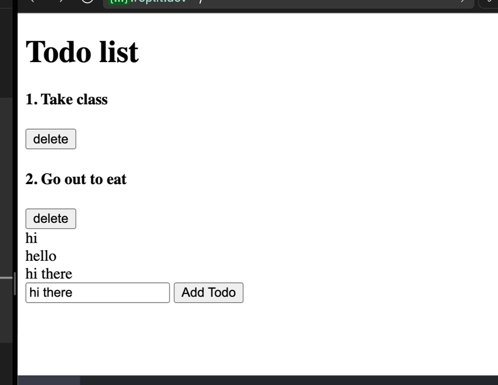

Write a function to add a TODO `text` to the list of todos

Steps -
1. Get the current text inside the input element
2. Create a new `div` element
3. Add the text `from` step 1 to the `div` element
4. Append the `div` to the todos list

